# CFO Pulse - Architecture Diagrams & Visual Documentation

This document contains all architecture diagrams in Mermaid format. Copy these into your Google Docs or use a Mermaid viewer.

---

## 1. High-Level System Architecture

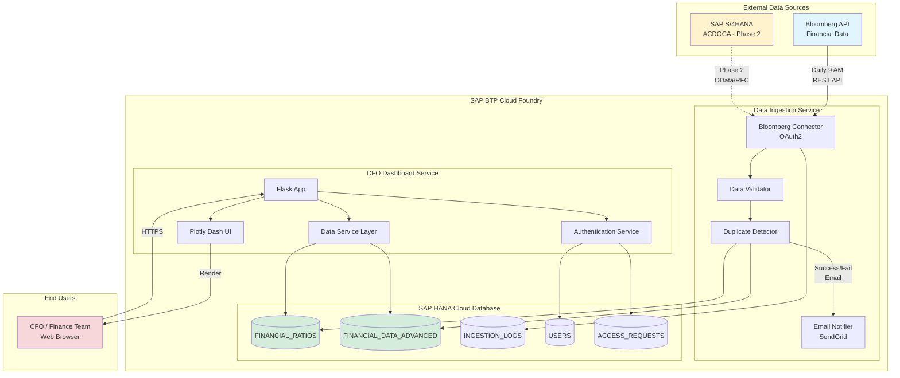

---

## 2. Data Ingestion Flow (Detailed)

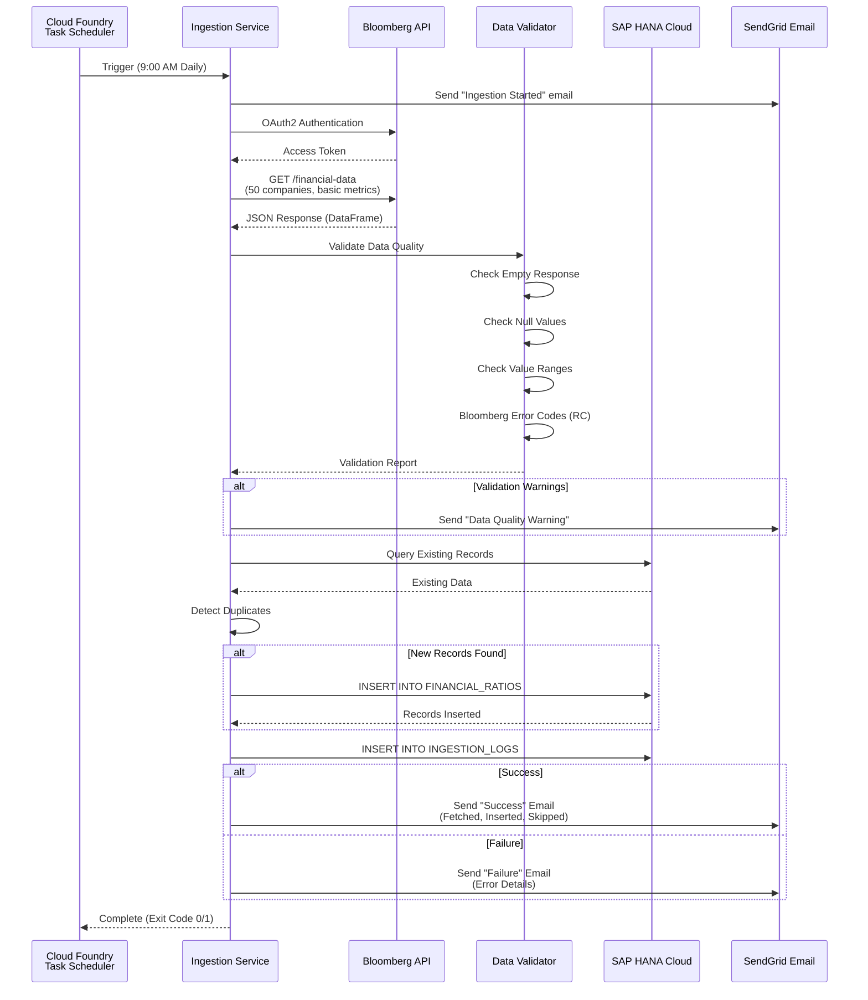

---

## 3. User Authentication Flow

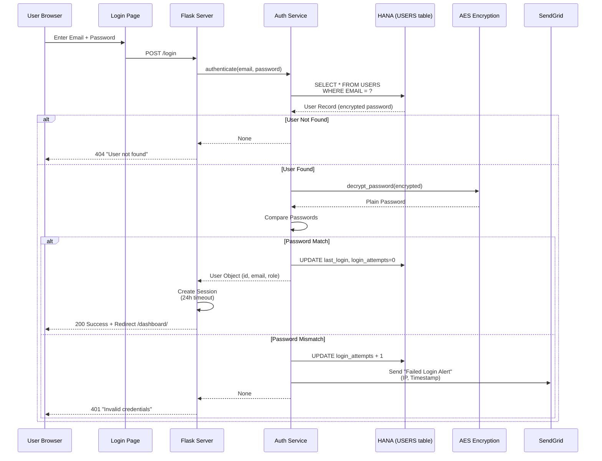

---

## 4. Dashboard Data Loading Flow

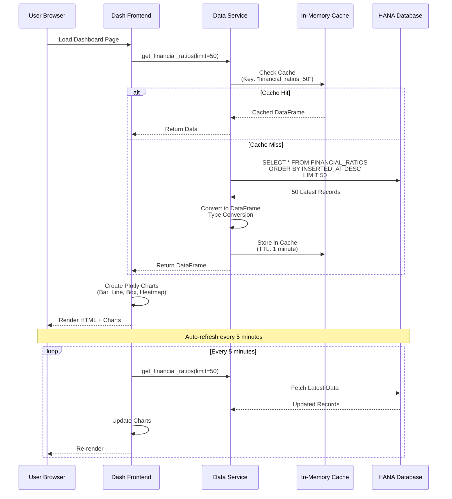

---

## 5. Company Comparison Feature Flow

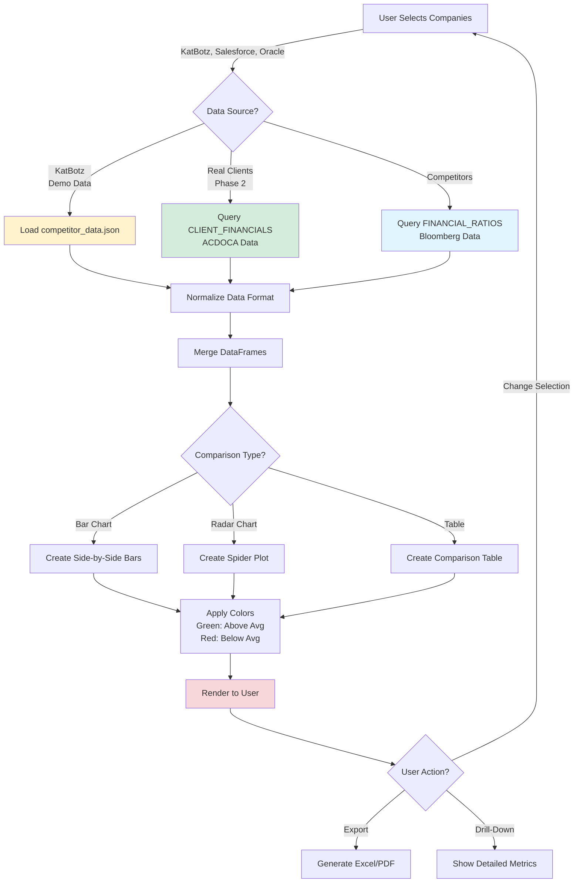

---

## 6. Database Schema (Entity Relationship Diagram)

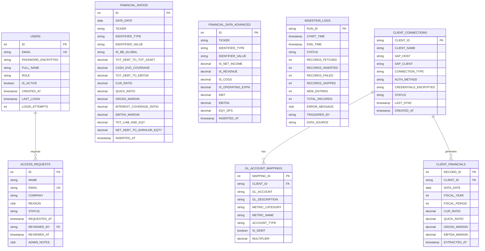

---

## 7. Phase 2: ACDOCA Integration Architecture

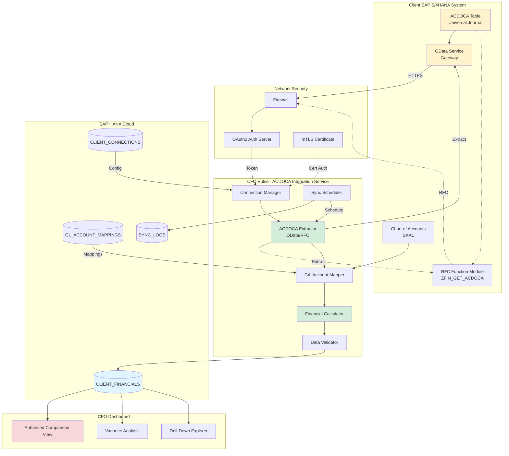

---

## 8. ACDOCA Data Extraction & Transformation Flow

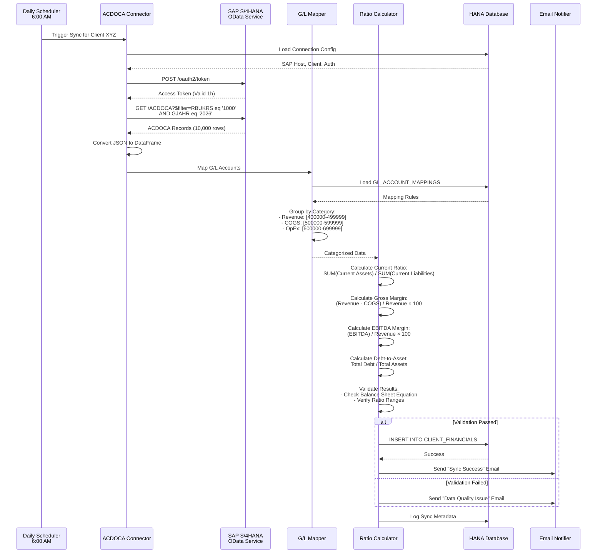

---

## 9. User Access Management Workflow (Phase 1 Completion)

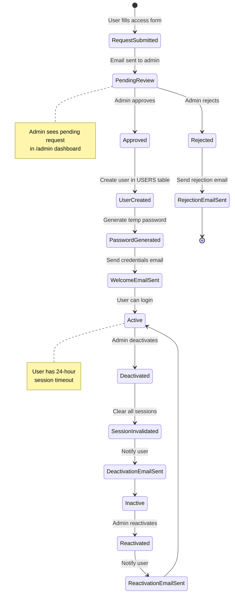

---

## 10. ML Forecasting Architecture (Phase 1 Completion)

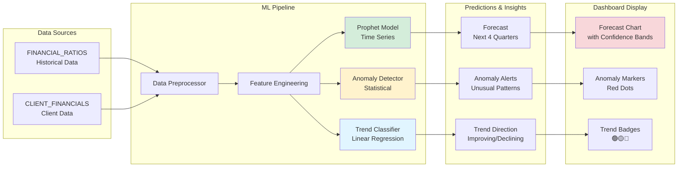

---

## 11. Deployment Architecture (Cloud Foundry)

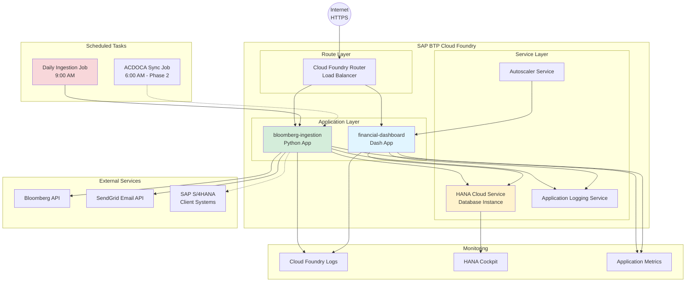

---

## 12. Security Architecture

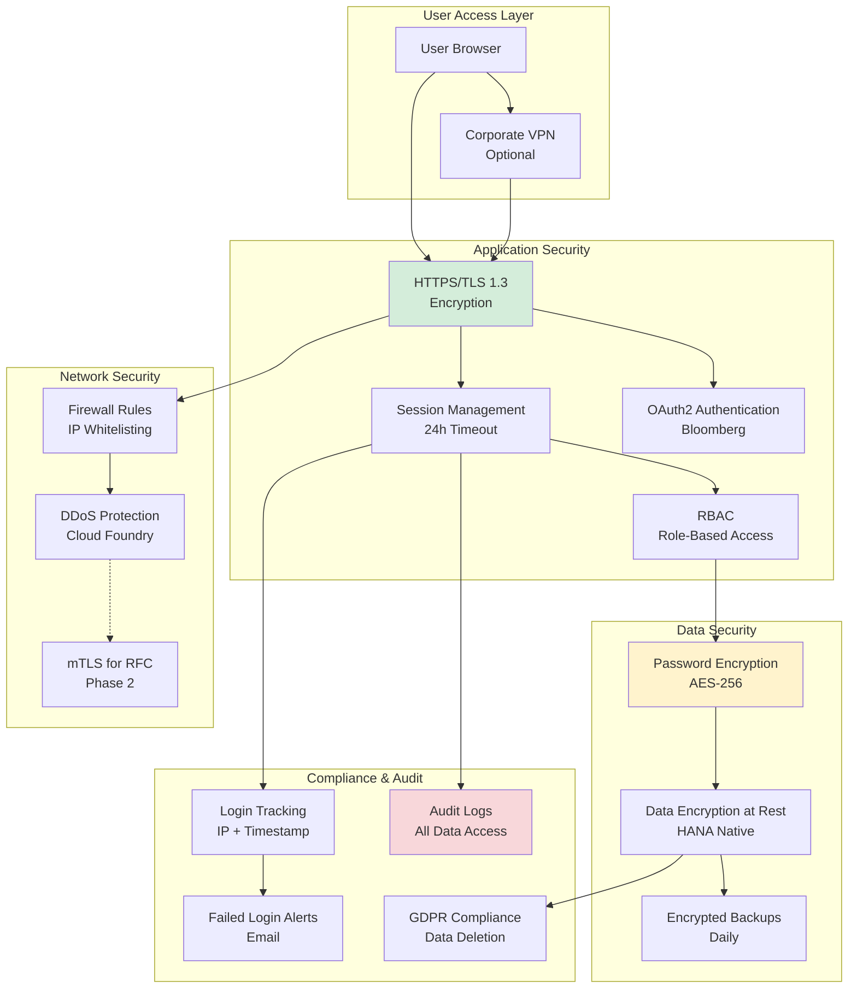

---

## 13. Data Quality & Validation Pipeline

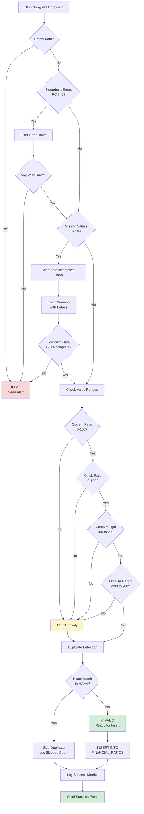

---

## 14. Performance Optimization Architecture

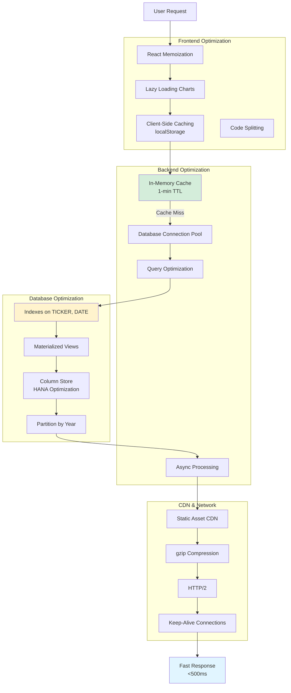

---

## How to Use These Diagrams

### Option 1: Render in Markdown Viewers
- **GitHub/GitLab**: Paste into .md files - diagrams render automatically
- **VS Code**: Install "Markdown Preview Mermaid Support" extension
- **Online**: Use https://mermaid.live/ to preview and edit

### Option 2: Google Docs
1. Install "Mermaid Diagram Viewer" add-on for Google Docs
2. Or convert to images:
   - Go to https://mermaid.ink/
   - Paste Mermaid code
   - Download as PNG/SVG
   - Insert into Google Docs

### Option 3: Export as Images
```bash
# Using Mermaid CLI
npm install -g @mermaid-js/mermaid-cli
mmdc -i diagram.mmd -o diagram.png
```

---

**All diagrams are scalable, editable, and version-controlled!**
